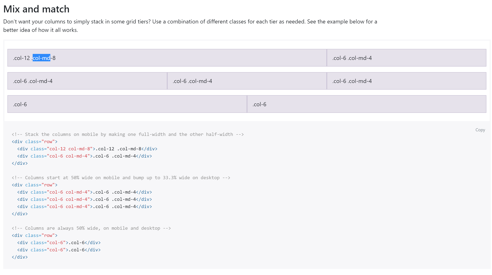
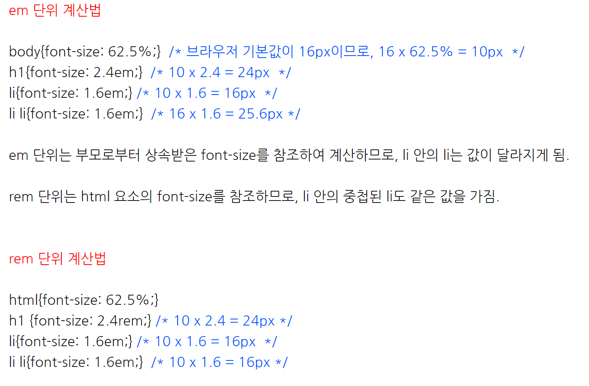
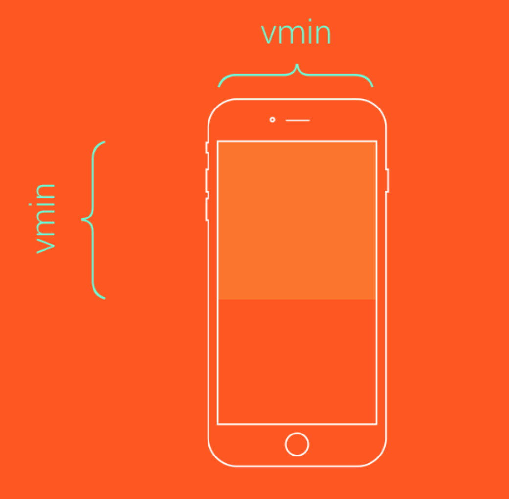

# MediaQuery-study
* 반응형 웹페이지를 위한 미디어쿼리 스터디 레파지토리입니다.
* @media 브라우저 지원

```
ie9+, chrome 21+, firefox3.5+, safari4.0+, opera 9+
```

## 1. 미디어 쿼리 사용법
* css 내부 삽입

```html
<!-- link요소에 있어서의 CSS 미디어 쿼리 -->
<link rel="stylesheet" media="(max-width: 800px)" href="example.css" />
```

* 링크 연결
```html
<!-- 스타일 이벤트 내의 CSS 미디어 쿼리 -->
<style>
@media (max-width: 600px) {
  .container {
    display: none;
  }
}
</style>
```

## 2. 미디어 쿼리 문법
### 1) 연산자
------------
```html
and | not | only | ,
```
* **and 연산자** : 여러 미디어 특징들을 하나로 결합
* **, (or) 연산자** :  쉼표로 분리된 각 목록은 각각 개별 미디어 퀴리임
* **not 연산자** : 전체 미디어 쿼리를 부정하기 위해 사용
* **only 연산자** : 미디어 쿼리를 지원하지 않는 브라우저가 주어진 스타일을 적용하는 것을 방지
( not이나 only를 사용하려면 미디어 타입을 규정해야함 / 미디어 쿼리는 대소문자 구별x)

```style
@media (min-width: 700px) {background-color: yellow;}
```

* 위 구문에서 미디어 타입 생략되어 있지만, 미디어 타입의 기본값은 **all = @media all and(min-width: 700px) {...}**
#### ① and 연산자의 사용

* 새로운 미디어 특징들을 **추가**할 때마다 and 연산자 사용
* 모든 유형의 장치이며 최소너비 700px, 세로방향 모드일 때만 적용한다는 뜻

```html
@media (min-width: 700px) and (orientation:portrait) {...}
```

* 프린트장치이며 최소너비 700px, 방향이 가로일 때 적용

```html
@media print and (min-width: 700px) and (orientation: landscape) {...}
```

#### ② 쉼표 연산자의 사용

* 쉼표는 각각 **개별** 미디어 퀴리로 인식
* 모든 장치에서 최소너비 700px이상일 때 적용하거나, 프린트 장치에서는 가로 방향일 때만 적용하겠다는 뜻

```html
@media (min-width: 700px), print and (orientation: landscape) {...}
```

#### ③ not 연산자의 사용

* not은 **전체 미디어쿼리를 수식**함. 즉 not은 all and (color)를 포함하여 부정
* @media not **(all and(color))** {...}와 같은 말. 모든 색상 장치에서 이 스타일을 적용하지 않겠다는 뜻. 쉼표로 분리하여 사용할 때, 미디어 구문은 개별 미디어 쿼리로 인식하므로 not은 쉼표 이후에 영향 미치지지 않음

```html
@media not all and (color) {...}
```

* 모든 스크린 색상 장치에서 적용하지 않거나, 프린트 색상 장치에서 적용하겠다는 뜻

```html
@media not screen and (color), print and (color)
```

#### ④ only 연산자의 사용

* 오직 스크린에 색상 장치일 때만 이 스타일을 적용하겠다는 뜻.

```html
<link rel="stylesheet" media="only screen and (color)" href="example.css" />
```

### 2) media type(미디어 종류)
------------
```html
all | print | speech | screen
```
* **all** : 기본값. 모든 미디어 장치에 사용됨
* **print** : 프린터에 적용
* **screen** : 컴퓨터 스크린, 테블릿, 스마트폰 등..
* **speech** : 페이지를 읽어주는 화면 낭독기

(퇴화된 미디어 종류 : aural, braille, embossed, handheld, projection, tty, tv)

### 3) media feature(미디어 특징)
------------
```html
| width | min-width | max-width
| height | min-height | max-height
| device-width | min-device-width | max-device-width
| device-height | min-device-height | max-device-height

| aspect-ratio (min- / max- 접두어 사용가능)
| device-aspect-ratio (min- / max- 접두어 사용가능)
| color (min- / max- 접두어 사용가능)
| monochrome (min- / max- 접두어 사용가능)
| resolution (min- / max- 접두어 사용가능)
| scan | grid

```

#### ① width 화면 영역 너비(브라우저 창 같은)
* 모든 장치에서 최소너비 20em 이상이면 적용

```html
@media (min-width: 20em){...}
```

* 스크린 장치 최소 화면이 500px보다 크고 800px보다 작을 때 스타일 적용

```html
<link rel="stylesheet" media="screen and (min-width: 500px) and (max-width:800px)" href="example.css" />
```

#### ② height 화면 영역 높이
#### ③ device-width 출력 장치의 너비(컴퓨터 스크린 같은)
* 장치 너비가 450px보다 작을 때 적용

```html
<link rel="stylesheet" media="screen and (max-device-width:450px)" />
```

#### ④ device-height 출력 장치의 높이
#### ⑤ aspect-ratio 화면 영역의 가로 세로 비
* 기호 **'/'** 을 사용하여, 앞에는 수평 픽셀 비율, 뒤에는 수직 픽셀 비율 (양수 and  정수)
* 가로 화면 비가 1:1 이상일 때 적용. 즉, 화면이 직사각이거나 세로일 때만 적용

```html
@media screen and (device-aspect-ratio: 1/1) {...}
```

#### ⑥ device-aspect-ration 출력 장치의 가로세로 비.(첫번째 값: 수평픽셀 비, 두번째 값: 수직 픽셀 비)
* 장치 가로 세로 비가 16:9일 때 적용.

```html
@media screen and (device-aspect-ratio: 16/9) {...}
```

#### ⑦ color 출력 장치의 색상 구성요소 당 비트 수(장치가 색깔 장치가 아니면 값은 0)
* 모든 색상 장치에 적용

```html
@media all and (color){...}
```

* 색상 구성요소당 최소 4비트를 지닌 장치에 적용

```html
@media all and (min-color: 4){...}
```

#### ⑧ color-index 장치가 표시할 수 있는 색상 수
* 최소 색상 256색상을 지닌 모든 장치에 적용

```html
<link rel="stylesheet" media="all and (min-color-index: 256)" href="example.css" />
```

#### ⑨ grid 출력 장치가 그리드 장치 또는 비트맵 장치냐에 따라 결정
* 장치가 그리드 기반이면 값은 1. 그렇지 않으면 0
#### ⑩ monochrome 흑백(회색톤)장치에 색상 당 비트 수
* 장치가 흑백이 아니면 값은 0
* 모든 흑백 장치에 적용

```html
@media all and (monochrome){...}
```

#### ⑪ orientation 화면이 가로 모드인지, 세로 모드인지 지정
* 오직 세로 방향에서만 적용

```html
@media all and (orientation: portrait){...}
```

#### ⑫ resolution 출력 장치의 해상도
* 해상도는 dpi(dots per inch)나, dpcm(dots per cinimeter)로 지정
* 최소 300dpi 이상 해상도를 지닌 장치에 적용

```html
@media screen and (min-resolution: 3000dpi){...}
```

#### ⑬ scan 텔레비전 출력 장치의 스캐닝 과정
* 값은 progressive | interlace
* tv값은 퇴화됨 -> 사용x

## 3. IE6~8에서 미디어 퀴리를 적용하려면?
* 구글에서 제공하는 자바스크립트 라이브러리 사용하면 IE6~8 미디어쿼리 작동함.
* **조건부 주석**을 통해 스크립트를 감싸며, IE9 이하에서만 스크립트가 로드되며, **다른 브라우저는 이 구문을 무시**함.
* **주의** : </body> 바로 위에 위치할 것. @import로 된 스타일시트에서는 작동하지 않음.

```html
<!-- css3-mediaqueries.js for IE less than 9 -->
<!-- [if lt IE 9]>
<script src="http://css3-mediaqueries-js.googlecode.com/svn/trunk/css3-mediaqueries.js"></script>
<![endif]-->
```

```html
:
<meta name="viewport" content="width=device-width, initial-scale=1">
:
```

* edge mode, IE 버전 중 가장 최신 모드로 표시

```html
<meta http-equiv="X-UA-Compatible" content="IE=edge,chrome=1" />
```

## 4. 유동적 그리드, 이미지, 크기 조절이 가능한 글꼴

```
Fluid Grids : 유동적인 그리드
Fluid Images : 유동적인 이미지
```
### 1) 그리드란?
* 웹페이지를 수직 수평선으로 분할하는 레이아웃 요소
* https://getbootstrap.com/docs/4.0/layout/grid/
* 한국어 : http://bootstrapk.com/css/
* 그리드 예제 : http://bootstrapk.com/examples/grid/

<p align="center">
	
</p>

### 2) 유동적인 그리드
* 고정형 단위를 백분율(%)로 바꾸는 법 : 구하려는 요소의 값을 가장 큰 요소의 값(브라우저 창 or wrapper)으로 나눈다.

```
wrapper 1040px / contents 780px / sidebar 200px / margin 60px
```

* **content**의 백분율? 1040px / **780px**
* **margin**의 백분율? 1040px / **60px**

```
wrapper 100% / contents 75% / sidebar 19% / margin 5%
```

### 3) 유동적인 이미지
* 화면크기에 따라 이미지도 조절이 되게 하려면 위와 같이 **백분율 값 이용가능**
* **이미지 > 부모요소** 일 경우 부모 요소의 너비대로 이미지 표시됨

### 4) 크기 조절이 가능한 글꼴

* **em & rem** : 현재 글꼴 크기에 상대값. 2em = 현재글꼴 크기의 2배
* **rem** : root em의 약자. root 요소 = html(최상위) 요소
* **%(백분율)** : 부모에 상대값. em과 비슷

* 주의점 : 상대단위 em과 % 값은 부모로부터 물려받은 font-size값으로 계산 -> 중첩구조에는 글꼴 일관성 유지 x

<p align="center">
	
</p>

## 5. css 단위
### 1) vh / vw
* vh와 vw는 **뷰포트의 너비값과 높이값에 상대적인 영향**을 받는다
* vh 요소는 높이값의 **100분의 1**의 단위입니다.
* 예를 들어 브라우저 높이값이 **900px**일때 **1vh는 9px**이라는 뜻이 되지요.
* 그와 유사하게 뷰포트의 너비값이 **750px**이면 **1vw는 7.5px**이 됩니다.
* 스크린의 너비값에 꽉 차는 헤드라인

```
.slide {
    height: 100vh;
}
```

### 2) vmin / vmax
* **vmin과 vmax는 너비값과 높이값에 따라 최대, 최소값을 지정**할 수 있습니다.
* 예를 들면 브라우저의 크기가 **1100px 너비**, 그리고 **700px 높이**일때 **1vmin은 7px**이 되고 **1vmax는 11px**이 됩니다.
* **너비값이 다시 800px**이 되고 **높이값이 1080px**이 되면 **vmin은 8px**이 되고 **vmax는 10.8px**이 됩니다.
* 터치화면 양 변에 가득차는 정사각형 요소를 만들때

```javascript
.box {
    height: 100vmin;
    width: 100vmin;
}
```

<p align="center">
	
</p>


------------
**출처**
* https://aboooks.tistory.com/365
* https://developer.mozilla.org/ko/docs/Web/Guide/CSS/Media_queries
* https://www.w3schools.com/cssref/css3_pr_mediaquery.asp
* https://www.htmlgoodies.com/beyond/css/introduction-to-css-media-queries.html
* 생활코딩 유튜브 주소 : https://opentutorials.org/course/2418/13517
* css 단위 : https://webdesign.tutsplus.com/ko/articles/7-css-units-you-might-not-know-about--cms-22573
